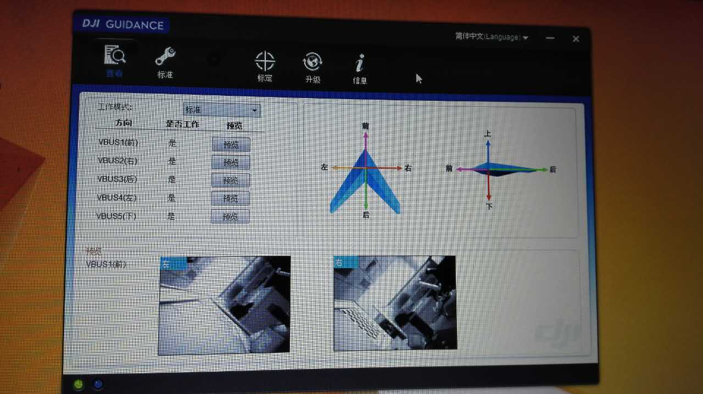
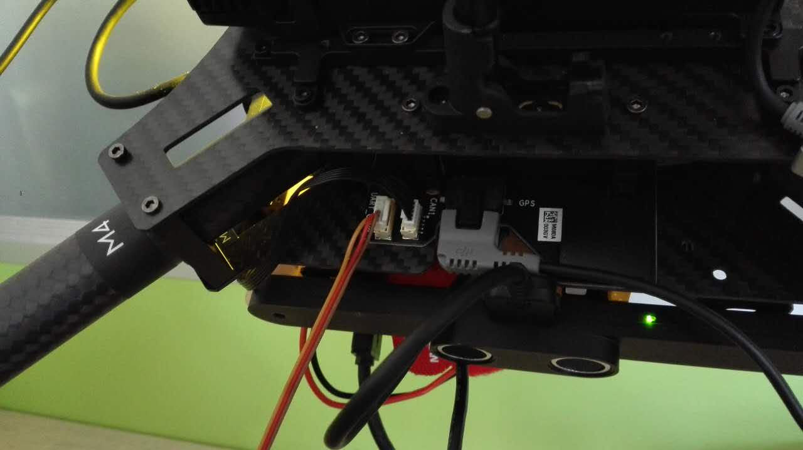
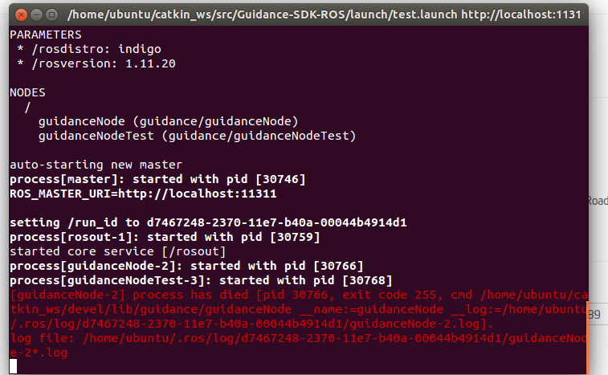

## 预备条件

 | 系统 | 版本 |
 |-- |--|
 |Jetson tk1 | L4T r24.1 （jetpack2.2）|
 | Guidance | 固件1.4.0|
 | DJI M100 | 1.2.0.90|
 | ros | indigo|

Guidance SDK fork自[这里](https://github.com/dji-sdk/Guidance-SDK-ROS)，做了一些显示和配置上的修改，核心代码没有改变。
## 已测试的情况
1. Guidance和飞机单独配合工作正常。表现为飞机屏蔽GPS，使用Guidance，悬停很稳。
2. Guidance和SDK（运行于TK1，上述表格中的配置），工作正常。
3. Guidance和飞机链接（can），同时链接至电脑，使用调参软件，可以读出图像。如下图

## 运行步骤
1. 编译catkin_make，注意我在TK1上使用的是另外一个branch（tegra-ubuntu）的代码。
2. 使用对应的launch文件，启动节点。

## 问题

单独启动节点 guidanceNode 错误为
Error: e_disparity_not_allowed at 297,/home/ubuntu/catkin_ws/src/Guidance-SDK-ROS/src/GuidanceNode.cpp
